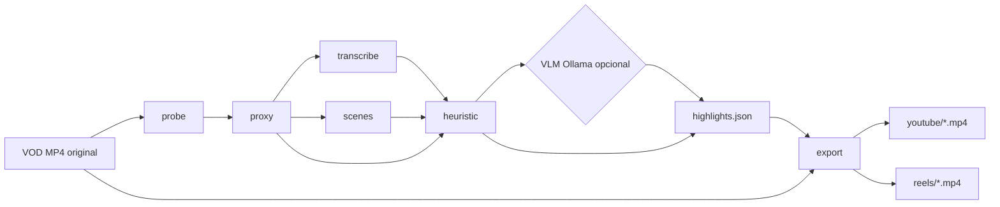

# Guia do projeto Reels

Documento de referência: o que o pipeline faz, o que cada fase consome no PC, e **como o sistema decide onde cortar o vídeo** (incluindo o papel da IA).

---

## 0. Atualização: features plugáveis e estabilidade (WSL)

O projeto agora é organizado em **features** selecionáveis na UI (`web/src/features/`,
despachadas pelo `JobManager`):

- **Galeria** — hub central: upload de MP4, fila de downloads da Twitch (2 URLs em paralelo,
  fragmentos HLS concorrentes via yt-dlp), listagem de VODs e clipes exportados. Todas as
  outras abas selecionam vídeo a partir da galeria.
- **Gerar Reels** — lista os highlights para revisão e só gera os clipes selecionados.
  Agora roda **só com Whisper + heurísticas** (o **VLM foi removido** do caminho padrão,
  era a principal causa de travamento no WSL).
- **Limpar vídeo** — transcreve com timestamps por palavra, corta **silêncios** entre as
  falas e **erros detectados por LLM** (`qwen2.5:14b`), você revisa a lista de cortes
  (EDL) e então renderiza **um** vídeo corrigido em 16:9 (YouTube) e 9:16 (Reels/TikTok).
- **Em breve** — placeholder para a próxima feature.

Mitigações de travamento (ver [WSL.md](WSL.md)): sem remux do VOD inteiro
(`proxy.make_preview: false`, original servido por HTTP range), detecção de cena
**desligada por padrão** (`analysis.scene_detection: false`, e downscaled quando ligada),
**Whisper em blocos** (`hardware.whisper_chunk_minutes`), **limite de threads**
(`ffmpeg_threads`/`opencv_threads`) e **cancelamento** de upload/análise/export/render.

O fluxo abaixo descreve a feature **Gerar Reels**; a fase `vlm` é opcional e fica
desligada por padrão.

---

## 1. O que é este projeto?

O **Reels** é uma ferramenta **100% local** que:

1. Recebe um VOD longo da Twitch (geralmente `.mp4`, 1080p, várias horas).
2. **Encontra momentos interessantes** (highlights) usando sinais automáticos + IA opcional (Ollama).
3. **Exporta clipes curtos** em dois formatos:
   - **YouTube** — 16:9 (1920×1080)
   - **Instagram Reels** — 9:16 (1080×1920), com duração máxima configurável (ex.: 90 s)

Nada é enviado para a nuvem. O corte final sempre parte do **vídeo original** (não do proxy de análise).

---

## 2. Visão geral do fluxo



**Resumo em uma frase:** o pipeline **pontua janelas de tempo** (ex.: 30 s); as melhores viram intervalos `start`/`end` em `highlights.json`; o FFmpeg **corta o original** nesses segundos.

---

## 3. Como a IA “sabe” onde cortar?

A IA **não edita o vídeo diretamente** e **não escolhe frames pixel a pixel**. O fluxo é:

### 3.1 O vídeo é dividido em janelas de tempo

Por padrão (`analysis.window_seconds: 30`), o VOD inteiro vira blocos:

- `0:00 – 0:30`
- `0:30 – 1:00`
- `1:00 – 1:30`
- … até o fim

Cada janela recebe **notas numéricas** de várias fontes.

### 3.2 Sinais automáticos (sem IA)

| Sinal | O que mede | Exemplo no gameplay |
|--------|------------|---------------------|
| **Áudio** | Picos de volume (RMS) | grito, explosão, música alta |
| **Movimento** | Diferença entre frames (OpenCV) | fight, câmera agitada |
| **Cenas** | Cortes de cena (PySceneDetect) | transição, tela de morte, menu |
| **Palavras-chave** | Texto do Whisper | “clutch”, “insane”, “no way”, etc. |

Isso gera um **score heurístico** por janela (0–1, combinando pesos do YAML).

### 3.3 IA (VLM) — só nas janelas mais promissoras

No modo `auto`, o Ollama **não analisa o VOD inteiro**. Só as janelas no **top ~15%** do score heurístico (até `max_vlm_windows`, ex.: 80).

Para cada janela candidata:

1. O sistema extrai **5 frames** do trecho (redimensionados ~480p).
2. Envia frames + **trecho da transcrição** para o modelo de visão (`qwen2.5vl:7b`).
3. O modelo responde JSON, por exemplo:

```json
{
  "score": 0.85,
  "title": "Clutch no último segundo",
  "reason": "Team fight com reação do streamer",
  "tags": ["clutch"]
}
```

O `score` da IA é **misturado** com o score heurístico (`hybrid_weights`: 40% heurística + 60% VLM no preset Twitch).

### 3.4 De score para “corte”

As melhores janelas viram entradas em `highlights.json`, cada uma com:

- `start` / `end` em **segundos** no VOD original
- `title`, `reason`, `score`

Antes de exportar, o sistema aplica **padding** (config `clip`):

- `pre_pad_seconds` (ex.: 3 s **antes** do momento)
- `post_pad_seconds` (ex.: 5 s **depois**)
- `min_duration` / `max_duration_*` — evita clipes curtos demais ou longos demais
- `dedupe` — remove highlights muito sobrepostos
- `max_clips` — limita quantidade (ex.: 15)

### 3.5 Export (FFmpeg)

O FFmpeg recebe ordens do tipo:

```text
-ss <start> -i <VOD_original> -t <duração> …
```

Ou seja: **o “corte” é matemático** — segundo exato no arquivo — com base nos timestamps escolhidos pelo ranking. A IA só influencia **quais intervalos** entram na lista; o **corte físico** é FFmpeg no arquivo original.

### 3.6 Modos de operação

| Modo | IA VLM | Resultado |
|------|--------|-----------|
| `gaming` | Não | Só heurística (rápido) |
| `auto` | Sim, se Ollama disponível | Heurística + VLM + merge; fallback heurística se Ollama offline |
| `multimodal` | Sim (obrigatório) | Depende do VLM |

---

## 4. As etapas do frontend (probe → export)

A barra de progresso usa pesos relativos (`src/reels/progress.py`). Abaixo: **função**, **como funciona**, **o que consome no PC**.

Legenda de consumo:

- **CPU** — processador (seu i5-13400F)
- **GPU** — placa (RTX 3060)
- **RAM** — memória
- **Disco** — leitura/gravação SSD

---

### 4.1 `probe` (~2% da barra)

**O que faz**

- Roda `ffprobe` no MP4.
- Lê: duração, resolução (1080p), FPS, codec, tamanho do arquivo.

**Para que serve**

- Planejar janelas de análise, validar que o arquivo é um vídeo legível, checar espaço em disco.

**Consumo**

| Recurso | Nível |
|---------|--------|
| CPU | Muito baixo (segundos) |
| GPU | 0% |
| RAM | Baixo |
| Disco | Leitura mínima (metadados) |

**Arquivos**

- Dados ficam em memória; checkpoint em `state.json` depois.

---

### 4.2 `proxy` (~8% da barra)

**O que faz**

- Prepara material para **análise** (não é o vídeo final dos clipes).
- **Padrão atual (`proxy.video_mode: audio_only`):**
  - Extrai apenas `*_audio_16k.wav` (mono, 16 kHz) para o Whisper.
  - Usa o **MP4 original** para movimento, cenas e frames do VLM.
- **Modos alternativos** (YAML):
  - `copy` — remux do vídeo sem re-encode
  - `transcode` — gera `*_proxy.mp4` em 720p com `libx264` (legado)

**Para que serve**

- Whisper precisa de áudio leve e constante.
- Análise de vídeo precisa de um arquivo seekável; com `audio_only`, esse arquivo é o próprio VOD.

**Consumo (`audio_only`)**

| Recurso | Nível |
|---------|--------|
| CPU | Médio (decode de áudio do MP4; bem menos que re-encode de vídeo) |
| GPU | 0% |
| RAM | Baixo |
| Disco | Grava um WAV (bem menor que o VOD) |

**Consumo (`transcode` 720p — antigo)**

| Recurso | Nível |
|---------|--------|
| CPU | **Alto** (~80–95% com `libx264`; era o gargalo que você viu) |
| GPU | 0% (encode por software) |
| Disco | Grava proxy MP4 + WAV |

**Tempo típico (VOD ~4 h)**

- `audio_only`: ~2–8 min  
- `transcode` 720p: ~10–20 min  

---

### 4.3 `transcribe` (~25% da barra)

**O que faz**

- **faster-whisper** transcreve o WAV.
- Gera `segments.json`: lista de trechos com `start`, `end`, `text`.

**Para que serve**

- Detecção de palavras-chave (“clutch”, “insane”, …).
- Contexto de texto para o VLM em cada janela.

**Consumo**

| Recurso | Nível |
|---------|--------|
| CPU | Alto se fallback CPU |
| GPU | **Alto** se CUDA OK (`whisper_device: cuda`, modelo `medium`) |
| RAM | Médio–alto (modelo Whisper) |
| Disco | Leitura WAV; escrita `segments.json` |

**Nota WSL**

- Se faltar `libcublas`, o projeto cai para CPU e avisa no log.

**VRAM**

- Whisper e Ollama **não rodam ao mesmo tempo** de propósito (evitar estourar 12 GB).

---

### 4.4 `scenes` (~5% da barra)

**O que faz**

- **PySceneDetect** no vídeo de análise (original ou proxy).
- Detecta mudanças de cena (cortes visuais).

**Para que serve**

- Janelas com muitos cortes podem ser momentos de ação, morte, troca de tela.

**Consumo**

| Recurso | Nível |
|---------|--------|
| CPU | Médio–alto (decode + análise de frames) |
| GPU | 0% |
| RAM | Médio |
| Disco | Leitura sequencial do vídeo |

---

### 4.5 `heuristic` (~10% da barra)

**O que faz**

1. **Áudio** — picos de energia por janela de 30 s.  
2. **Movimento** — amostra ~2 fps do vídeo, redimensiona para ~480p, mede diferença entre frames.  
3. **Cenas** — densidade de cortes por janela.  
4. **Keywords** — conta palavras do preset no transcript da janela.  
5. Combina tudo com pesos (`heuristic_weights` no YAML) → **ranking** de janelas.

**Para que serve**

- Achar candidatos a highlight **sem IA**.
- No modo `auto`, **pré-filtra** o que vai para o VLM (só o topo %).

**Consumo**

| Recurso | Nível |
|---------|--------|
| CPU | Médio (OpenCV + NumPy; pode ler o VOD inteiro para movimento) |
| GPU | 0% |
| RAM | Médio |
| Disco | Leitura do vídeo de análise |

**Modo `gaming`**

- Para aqui (em termos de “inteligência”) e gera `highlights.json` só da heurística.

---

### 4.6 `vlm` (~35% da barra)

**O que faz**

- Para cada janela pré-filtrada:
  - Extrai 5 imagens JPEG (base64).
  - Monta prompt (`prompts/twitch_highlight_window.txt`).
  - Chama **Ollama** (`qwen2.5vl:7b`) → JSON com score, título, motivo.
- Salva checkpoint por janela em `vlm/<start-end>.json`.
- No `auto`, faz **merge** heurística + VLM → lista final de highlights.

**Para que serve**

- “Entender” visualmente clutch, fail, reação, fight — coisas que RMS/movimento não captam bem.

**Consumo**

| Recurso | Nível |
|---------|--------|
| CPU | Médio (extração de frames, HTTP para Ollama) |
| GPU | **Alto** (inferência do modelo no Ollama — VRAM) |
| RAM | Média no Python; **VRAM** no processo Ollama |
| Disco | Leitura pontual do vídeo (seek por janela) |

**Tempo**

- Depende de quantas janelas passam no filtro (dezenas a ~80).
- Pode ser **1–2 h** em VOD longo no modo `auto`.

**Se Ollama estiver offline**

- Modo `auto` usa só heurística e registra aviso no log.

---

### 4.7 `export` (~15% da barra)

**O que faz**

- Lê `highlights.json`.
- Para cada highlight, para cada perfil (`youtube`, `reels`):
  - FFmpeg: `ffmpeg -ss START -i VOD -t DURAÇÃO -vf …`
  - YouTube: escala/pad 1920×1080.
  - Reels: crop central 9:16 + escala 1080×1920; cap de duração (ex. 90 s).

**Para que serve**

- Gerar os MP4 finais que você vê na galeria da UI.

**Consumo**

| Recurso | Nível |
|---------|--------|
| CPU | Médio (demux, áudio, filtros) |
| GPU | **Médio–alto** se `h264_nvenc` ativo no preset |
| RAM | Baixo–médio |
| Disco | **Alto** — lê trechos do VOD original; grava muitos MP4 |

**Importante**

- Aqui usa o **VOD original em 1080p**, não o proxy de análise.
- Cada highlight × 2 formatos = muitos arquivos (ex. 15 × 2 = 30 MP4).

---

## 5. Tabela resumo — fase × recurso

| Fase | Ferramenta principal | CPU | GPU | Disco |
|------|----------------------|-----|-----|-------|
| probe | ffprobe | ○ | — | ○ |
| proxy | ffmpeg (áudio ou transcode) | ○–●●● | — | ○–●● |
| transcribe | faster-whisper | ●● | ●●● | ○ |
| scenes | PySceneDetect | ●● | — | ● |
| heuristic | OpenCV, NumPy, áudio | ●● | — | ● |
| vlm | Ollama + OpenCV frames | ● | ●●● | ○ |
| export | ffmpeg (+ NVENC opcional) | ●● | ●● | ●●● |

○ baixo · ● médio · ●● alto · ●●● muito alto  

---

## 6. Arquivos que o job deixa na pasta de saída

Exemplo: `temp/outputs/<job_id>/`

| Arquivo / pasta | Conteúdo |
|-----------------|----------|
| `state.json` | Checkpoint (fase, paths, flags de resume) |
| `*_audio_16k.wav` | Áudio para Whisper |
| `segments.json` | Transcrição por trechos |
| `vlm/*.json` | Resposta da IA por janela |
| `highlights.json` | **Lista final** com `start`, `end`, título — entrada do export |
| `youtube/*.mp4` | Clipes 16:9 |
| `reels/*.mp4` | Clipes 9:16 |
| `job_error.log` | Traceback se o job falhar |

---

## 7. Perguntas frequentes

### A IA escolhe o frame exato do corte?

Não. Ela pontua **janelas de ~30 s**. O corte usa `start`/`end` da janela + padding configurável. O FFmpeg corta em segundos contínuos.

### Por que meu clip não começa exatamente no “pulo”?

Por design: `pre_pad` e `post_pad` dão contexto antes/depois. Ajuste em `config/twitch_gaming.yaml` → seção `clip`.

### Posso confiar 100% nos cortes automáticos?

É um **assistente de curadoria**, não um editor humano. Revise `highlights.json` ou os clipes na UI; ajuste preset, keywords, pesos heurísticos ou modo `gaming` vs `auto`.

### O proxy deixa o clipe em qualidade pior?

Não para o export final. O proxy (ou o VOD direto na análise) só serve para **detectar** momentos; **export sempre lê o original**.

### Como acelerar um VOD longo?

- Modo `gaming` (sem VLM).
- `proxy.video_mode: audio_only` (já é o padrão).
- Whisper em CUDA (`scripts/install_cuda_wsl.sh`).
- Reduzir `max_vlm_windows` ou `prefilter_top_percent` no YAML.
- NVENC no export (`hardware.ffmpeg_video_encoder: h264_nvenc`).

---

## 8. Onde mexer na configuração

| Objetivo | Arquivo / chave |
|----------|------------------|
| Duração das janelas de análise | `analysis.window_seconds` |
| Quantas janelas vão para a IA | `prefilter_top_percent`, `max_vlm_windows` |
| Padding do corte | `clip.pre_pad_seconds`, `post_pad_seconds` |
| Máximo de clipes | `clip.max_clips` |
| Palavras que aumentam score | `keywords` |
| URL do Ollama | `ollama.host` |
| Modo proxy | `proxy.video_mode` |

Preset principal para Twitch: `config/twitch_gaming.yaml`.

---

## 9. Referência rápida — do upload ao clipe

1. **Upload** → VOD em `temp/vods/`.
2. **probe** → metadados.
3. **proxy** → WAV (+ vídeo de análise = original).
4. **transcribe** → texto falado.
5. **scenes** + **heuristic** → ranking de intervalos de 30 s.
6. **vlm** (opcional) → nota “humana” por imagem + texto.
7. **highlights.json** → top N intervalos com `start`/`end`.
8. **export** → FFmpeg corta o **mesmo VOD** nos timestamps.

A “mágica” da IA é **classificar trechos de tempo**, não editar timeline manualmente. O corte é **determinístico**: segundos do `highlights.json` + comando FFmpeg.
